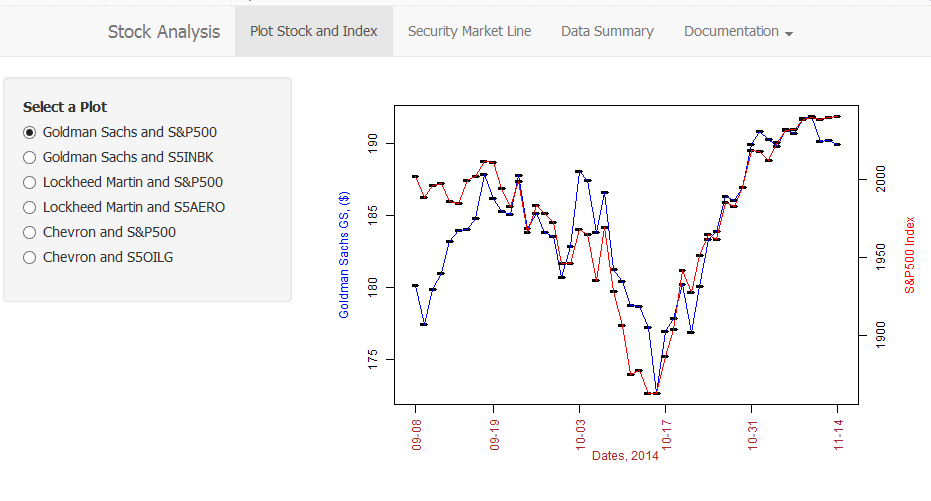

# The objectives of this shiny application are:

**1) Load stock price market data from a .csv file and plot share price of selected companies against the Standard and Poor (S&P500) index and other industry indices to observe trends.** 

**2) Plot excess daily returns of selected stocks versus their industry indices or vs. S&P500 index. Perform a linear regression analysis on the excess returns and present the Security Market Line SML (also known as single-factor index/market model), serving S&P500 and other industry indices as the market proxy. Report key-coefficients of the SML: Alpha and Beta.**

**3) Provide a functionality to summarize common stock price of selected companies as well as statistical summary of regression models.**



--- .class #id 

# SECURITY MARKET LINE (SML)
SML is a line of best fit through the returns on an individual security, plotted on vertical axis, relative to the returns for the market (or index proxy), plotted along the horizontal axis. In the example below, SML of JP Morgan vs S&P500 is constructed using the R-function "lm()":


```r
plot(SP500, JPM, main="Security Market Line: JP Morgan vs. S&P500", 
     col.main="blue", col.lab="red", pch=16) 
abline(lm(JPM~SP500), col="brown") + grid()
```


```
## numeric(0)
```

---

# SELECTED STOCKS

The chosen stocks are: 1) Goldman Sachs Group Inc. (Ticker: GS), 2) Lockheed Martin Corp. (Ticker: LMT), and 3) Chevron Corp. (Ticker: CVR). 

The corresponding industry indexes are: 1) Investment Banking & Brokerage (Bloomberg Ticker: S5INBK), 2) Aerospace & Defence (Bloomberg Ticker: S5AERO), and 3) Oil, Gas & Consumable Fuels (Bloomberg Ticker: S5OILG). One of the ways to evaluate stock performance is to compare how the three selected stocks are doing relative to other companies in the same sector, i.e, the industry/group index.The proxy for stock market comparison is the S&P500.

The SML is determined by using a statistical technique called regression analysis ("lm()" function in R).The slope of the line is the security's beta coefficient. Beta measures the risk of an individual stock relative to the market portfolio (for instance S&P500).Securities with betas greater than 1 are generally considered to be more volatile (or risky) than average. Similarly, securities with betas less than 1 are less volatile (risky). Beta is reported in this application.

This application consists of three tabs: stock price of the three selected companies can be plotted vs industry index or S&P500 in the tab "Plot Stock and Index". SML based on these stocks is estimated in tab "Security Market Line". Finally, a summary of the stock price or linear regression model is provided in tab "Data Summary".

---

# STOCK ANALYSIS (SINGLE-INDEX MODEL) USER INTERFACE(UI)

The "Security Market Line" Tab UI is shown below.


